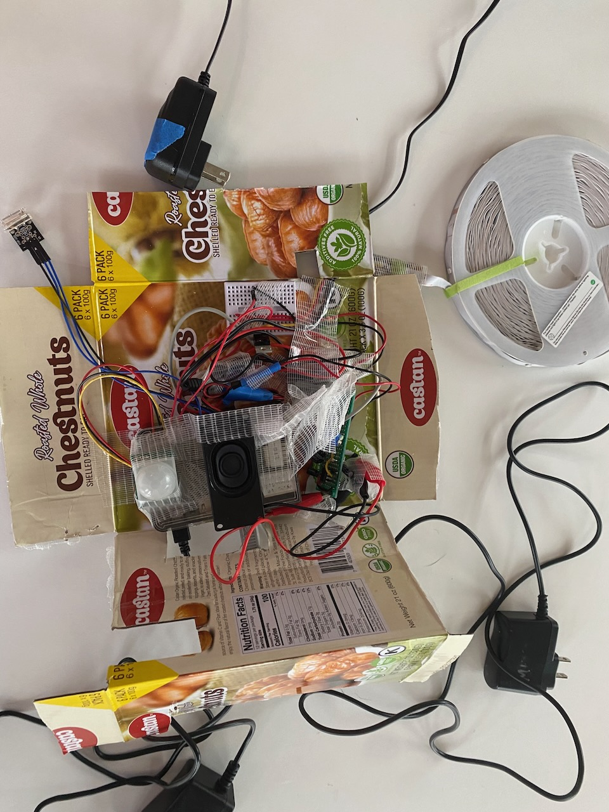
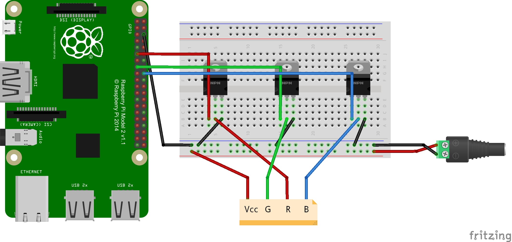
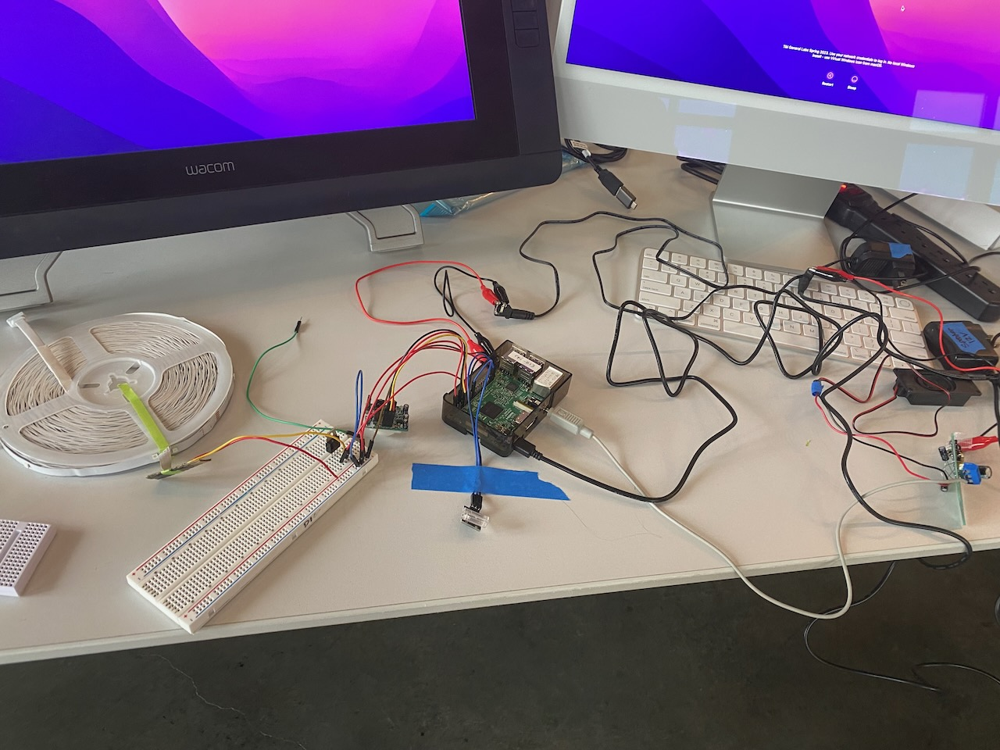

# Home Security System
### https://youtu.be/yhbOVKLq0LU

A home security system that detects motion, triggers an audio alarm and flashing red lights, and sends a signal to another device (built by [Olsen Budanur](https://github.com/olsenbudanur/nerf_pi_security)) that will shoot a nerf gun, take a photo of the intruder, and send the photo via SMS.
Flashing lights and alarm can be turned off by typing in the right password.

## Tutorials Used
1.LED Light Strip: https://dordnung.de/raspberrypi-ledstrip/
2.Shock sensor: https://iot-guider.com/raspberrypi/interfacing-knock-sensor-module-ky-031-raspberry-pi/

Creator Statement:
This project is a primary prototype for a holistic home security system. We designed the components based on real life expectation and aimed for it to have as much utility as possible. For example, we originally placed the password input outside the door, but then discovered that it would be easy for the intruder to disconnect the keypad and not trigger the alarm system. A stretch goal for this project was to build a knock sensor that is placed on the inside of the door, and the visitor will have to knock in the correct pattern to disarm the systems. The materials I used were Raspberry Pi, LED light strip, shock sensor/vibration sensor, PIR motion sensor and a DIY audio system. I purchased [IRLZ34N MOSFETs](https://www.amazon.com/gp/product/B08L8S3154/ref=ppx_yo_dt_b_asin_title_o00_s00?ie=UTF8&psc=1) from amazon as a switch to control the LED lights. I originally used a vibration sensor which is more sensitive than a shock sensor, but it quickly broke and I had to switch to a shock sensor instead.
This project could be useful to anyone wanting to enhance their home security system.

Final product
 

LED Light Strip Circuit
 

Milestone # 1
1. Be able to send signals from the local network | internet.
This part didn't take long because Olsen is experienced with sockets. Basically, we send a signal from my Raspberry Pi and his Raspberry Pi socket receives it.

Milestone # 2
1. Be able to make the LED light flash red
This part took the longest because I spent week trying to use the control that came with the LED light strip. I eventually gave up because I couldn't get the shared ground connected without breaking apart the LED control. I purchased [IRLZ34N MOSFETs](https://www.amazon.com/gp/product/B08L8S3154/ref=ppx_yo_dt_b_asin_title_o00_s00?ie=UTF8&psc=1) as mentioned in [this tutorial](https://dordnung.de/raspberrypi-ledstrip/).

2. Be able to connect the keypad to the raspberry pi for password input
I set up 4 buttons to act like a keypad and built a password-input system. I was able to also achieve the stretch goal of using a knock sensor to input password.

3. Be able to play alarm audio
Playing alarm audio was very easy with the amplifier and speaker circuit I built for the previous project.

 

Milestone # 3
1. Test the whole system
We tested the system on the last class and it works great!

